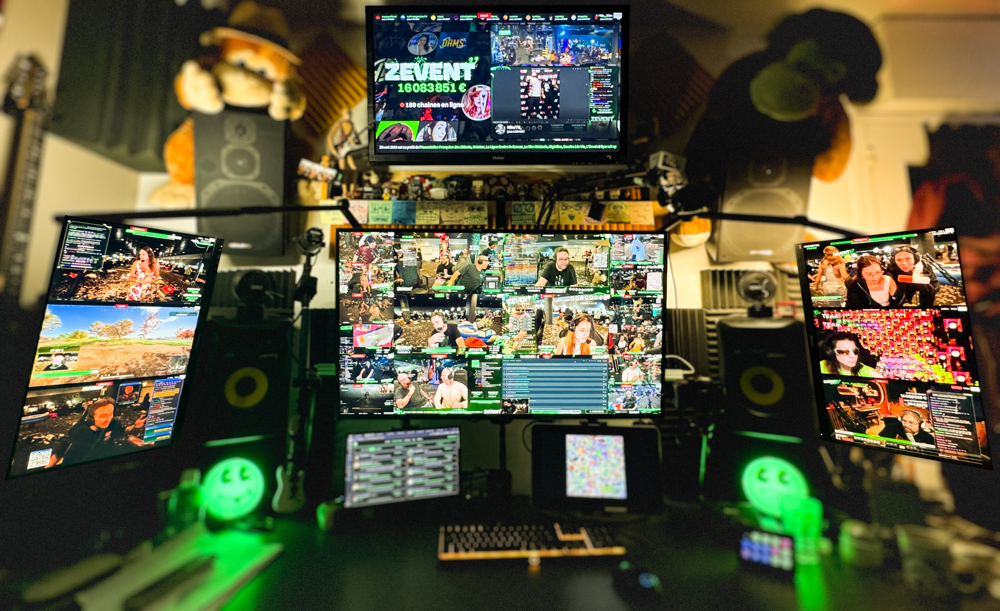

# [Live Jar](https://github.com/la-jarre-a-son/live-jar)

A multi-stream application to watch simultaneously many streams with multiple windows on different screens, that can be moved, pinned, switched, muted, and controlled from a single main window.

## Why this app ?

This is during the ZEvent 2024 (a french charity event on Twitch) that i started to feel FOMO, and tried to watch as much streamers as possible with many screens. But multistream solutions were not enough, so the idea started to emerge.

During ZEvent 2025, my web browser was only able to stream 9 channels at most, with heavy lags so I started my project, motivated by the charity event. In a few hours, I developed a beta version that was able to handle 25 live streams with low latency and a very few lags.

This app is now publicly available.



## Disclaimer

Live Jar is not affiliated with Twitch or Amazon. All Trademarks referred to are the property of their respective owners.

## Releases

Check out the releases on Github: [Releases](https://github.com/la-jarre-a-son/live-jar/releases)

### Unsigned App

Due to code sign certificates being a bit expensive, Live Jar is not signed (yet?).
If you are willing to help me sign this app, financially, don't hesitate to contact me.

So to install it on **Windows**, Windows Defender may block it, and warn you that this could be dangerous. You can still execute it anyway.

On **MacOS** though, the _.dmg_ or any downloaded unsigned file will be blocked, as if "app is damaged and can’t be opened".

You will need to unquarantine the file after you downloaded, by executing in a terminal:

```
xattr -dr com.apple.quarantine <Your Downloaded File Name>
```

## What then ?

### Build

This project is built with Electron & Webpack:

```
npm install

npm run start
 -or-
npm run package
```

### Planned features / Ideas

- [x] Multiple stream windows controlled from a main window
- [x] Authenticate with Twitch.tv to access chat and preview broadcasts
- [ ] Change audio output device
- [ ] Synchronized live streams
- [ ] Allow embedding any website content through iframes
- [ ] Add other streaming services (e.g. Youtube)

### Contribute / Bugs

This project is fully open to contribution and it would be appreciated to have some feedbacks and new ideas.
Please feel free to open an issue or open a Merge request.

For any UI or UX bug, please [Open an issue](https://github.com/la-jarre-a-son/live-jar/issues).
